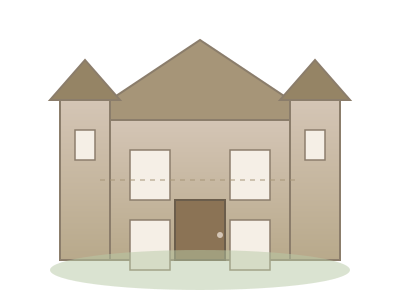

# 🚀 Быстрый старт

## 1. Локальный запуск (за 30 секунд)

```bash
# Клонируйте репозиторий
git clone https://github.com/kortul/invitation.git
cd invitation

# Откройте в браузере
# Mac: open index.html
# Windows: start index.html
# Linux: xdg-open index.html
```

Или используйте Live Server в VS Code для авто-обновления.

---

## 2. GitHub Pages (бесплатный хостинг)

### Вариант A: Через веб-интерфейс (1 минута)

1. Откройте https://github.com/kortul/invitation
2. **Settings** → **Pages** (в левом меню)
3. **Source**: выберите `main` → папка `/ (root)`
4. Нажмите **Save**
5. Подождите 1-2 минуты
6. Сайт доступен по: `https://kortul.github.io/invitation/`

### Вариант B: Автоматически (если уже настроено)

Просто запушьте изменения:
```bash
git add .
git commit -m "Обновление сайта"
git push
```

GitHub Pages обновится автоматически.

---

## 3. Замена иллюстраций

### Что нужно сделать:

1. Подготовьте SVG или PNG файлы:
   - `mansion.svg` — замок/особняк (главный элемент)
   - `bride-groom.svg` — жених и невеста
   - `botanical-top.svg`, `botanical-bottom.svg` — рамки сверху/снизу
   - `flower-corner.svg` — угловые цветы (4 шт.)
   - `garden-scene.svg` — сад для раздела "История"
   - `ceremony-icon.svg`, `cocktail-icon.svg`, `dinner-icon.svg`, `dancing-icon.svg` — иконки таймлайна
   - `gallery-placeholder-*.svg` — 6 фото для галереи
   - `closing-decoration.svg` — финальный декор
   - `footer-ornament.svg` — орнамент в подвал

2. Сохраните в папку `assets/` (перезаписав старые файлы)

3. Закоммитьте:
```bash
git add assets/
git commit -m "Новые иллюстрации"
git push
```

### Если имена файлов другие:

Откройте `index.html` и найдите строки:
```html

```

Замените `assets/mansion.svg` на ваш путь, например `assets/my-castle.png`.

---

## 4. Редактирование текста

Откройте `index.html` и найдите:

### Имена и дата:
```html
<h1 class="couple-names">
    <span class="name name-1">Александр</span>
    <span class="ampersand">&</span>
    <span class="name name-2">Екатерина</span>
</h1>
<p class="wedding-date">25 августа 2027</p>
```

### Раздел "История":
```html
<p class="story-text">
    Всё началось с одной случайной встречи...
</p>
```

### Место проведения:
```html
<strong>Замок "Ле Гранд"</strong><br>
ул. Садовая, 15<br>
г. Киров, Кировская область
```

### Контакты:
```html
<strong>Александр:</strong> +7 (XXX) XXX-XX-XX<br>
<strong>Екатерина:</strong> +7 (XXX) XXX-XX-XX
```

---

## 5. Изменение цветов (опционально)

Откройте `styles.css` и найдите `:root`:

```css
:root {
    --color-paper: #FDF8F3;      /* Фон (античная бумага) */
    --color-olive: #6B7B5F;       /* Оливковый акцент */
    --color-sage: #9CAF88;        /* Шалфей */
    --color-dusty-rose: #C9A9A6;  /* Пыльная роза */
    --color-ink: #2C2C2C;         /* Текст */
    --color-gold: #B8A98B;        /* Золотистый декор */
}
```

Меняйте hex-коды на свои цвета.

---

## 6. Проверка на мобильном

### Chrome DevTools:

1. Откройте `index.html` в Chrome
2. Нажмите `F12` (DevTools)
3. Нажмите `Ctrl+Shift+M` (Device Toolbar)
4. Выберите устройство (iPhone 12, Pixel 5 и т.д.)
5. Проверьте все секции

### Реальное устройство:

Загрузите на GitHub Pages и откройте ссылку на телефоне.

---

## 7. Финальные шаги

1. ✅ Проверили локально
2. ✅ Заменили иллюстрации
3. ✅ Отредактировали текст
4. ✅ Проверили на мобильном
5. ✅ Запушили на GitHub

**Готово!** 🎉

---

## 📞 Если что-то пошло не так

### Сайт не отображается на GitHub Pages:

- Подождите 2-3 минуты после пуша
- Проверьте: Settings → Pages → нет ли ошибок
- Убедитесь, что `index.html` в корне репозитория

### Анимации не работают:

- Проверьте консоль браузера (`F12` → Console)
- Убедитесь, что `script.js` подключён в `index.html`
- Отключите расширения браузера (иногда блокируют скрипты)

### Картинки не загружаются:

- Проверьте пути в `index.html`
- Убедитесь, что файлы в папке `assets/`
- Проверьте регистр имён (Linux чувствителен к `Mansion.svg` vs `mansion.svg`)

---

**Удачи в подготовке к свадьбе! 💕**
